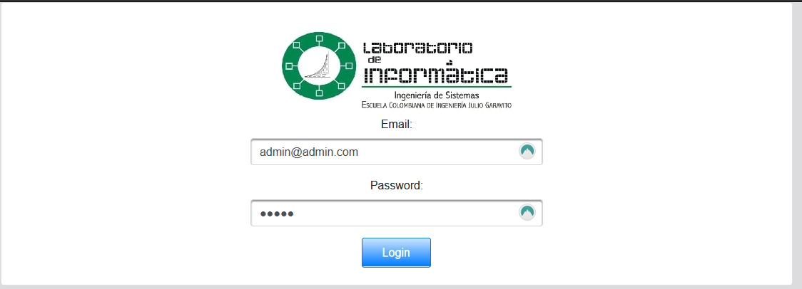

# ECI Historial de Equipos - Las Divinas

 

## CVDS 2020-2
### Product Owner
* Julian Mauricio Velasco Briceño
* Oscar David Ospina Rodriguez
### Scrum Master
* Diego Alejandro Murcia Céspedes 
### Team
* Juan Pablo Contreras Amaya
* Nikolas Bernal Giraldo
* Santiago Martinez Martinez

## Descripción del Producto
### Descripción General
El producto busca facilitar el proceso y solucionar los inconvenientes que se puedan presentar
a la hora de administrar equipos pertenecientes a una organización, en este caso la Escuela Colombiana de Ingeniería Julio Garavito.

### Manual de Usuario
En esta aplicacion se podran encontrar diferentes opciones como consultar, realizar registro, y otras opciones de administracion.

En primer lugar tendremos las consultar:\

Al dar click en alguna de ellas se deplegaran todos los equipos, elementos o laboratorios con los que se cuentan, esto dependiendo
de la consulta seleccionada. Una vez abierta se tendra algo del siguiente estilo:

En donde se podra ver toda la informacion detallada, pero ademas de esto se podra exportar dicha informacion a un
documento en EXCEL dando un click en el icono que aparece en la parte superior derecha de las tablas. Ademas, para el caso
de los equipos, laboratorios y elementos se tendra un boton con el nombre de novedades, que al dar click nos redireccionara a una
nueva pagina donde podremos ver las novedades registradas del elemento en cuestion seleccionado.

Por otro lado tendremos los registros:\

En cada uno de ellos se nos solicitara una informacion a completar para realizar el registro, y una vez realizado tendremos la opcion
de hacer el registro o volver a la pagina de inicio.

Luego tendremos las asociaciones:\

Aqui, en el caso de Asociar un Elemento a un Equipo, tendremos dos desplegables donde tendremos que escoger un Equipo al cual queramos asociar un elemento, y el elemento en cuestion. Una
vez hecho esto se procede a asociar el elemento y si tenia algun elemento asociado del mismo tipo, este que consideramos como el atiguo quedara libre para ser asociado a otro equipo o al mismo.

Luego esta Asociar Equipo a Laboratorio en donde se sigue la misma logica que Asociar un Elemento a un Equipo. En este caso se mostraran
todos los laboratorios activos y todos los elementos activos que pueden usarse para ser asignados.

Tambien tenremos los Dar de Baja:\

Aqui podremos seleccionar un elemento o equipo para dar de baja. En el caso de los elementos, solo se permitiran y mostraran los
elementos que no esten asociados a ningun equipo para que puedan ser dados de baja. Con los equipos es algo especial, ya que mostraremos
todos los equipos activos que se pueden dar de baja, pero tambien le permitiremos al usuario tomar la decicion de dar de baja los elementos que el
equipo tiene asociado o solo devincularlos y dejarlos libres para vincular. Al momento de un equipo ser dado de baja este, en caso tal de estar vinculado
a un laboratorio, quedara totalmente desvinculado.

Por ultimo tendremos la opcion de cerar un laboratorio:\

Aqui se le permitira seleccionar un laboratorio para cerrar de todos los que se encuentren activos. Al momento de cerrar dicho laboratorio, este
desvinculara todos los equipos que tuviera y los dejara libres para ser vinculados a otros laboratorios. El laboratorio quedara como inactivo.

### Imágenes y Descripción de las Funcionalidades más Importantes
#### Login Page
Con esta funcionalidad en el proyecto nos aseguramos de tener un control de usuarios, dar permiso
a quien puede entrar y no. Además de esto tener un control de que usuarios pueden realizar cambios 
y quienes no ya que contamos con roles para esto.\

#### Consultas
Otra de las funcionalidades importantes es que tanto usuarios como administradores podran consultar la informacion
mas relevante sobre sus equipos, elementos y laboratorios que se tengan.\

Ademas de poder consultar la informacion mas relevante tambien podran exportar en excel esta informacion que encuentren
dando click al icono de EXCEL que aparece en cada una de las consultas.\

#### Registros
La funcionalidad de registros permite que todas las personas con un rol de administrador ingresen
nuevos equipos, laboratorios o elementos para que sean administrados con ayuda de la aplicacion.\

#### Asociar y Dar de Baja
Prestamos la funcionalidad de que alguien con rol de administrador logre administrar todos los elementos que se posean, pero
admeas podra controlar, por ejemplo, a que equipo asigna ciertos elementos o que elementos decide dar de baja ya sea porque
tengan problemas o se encuentren dañados.\

## Arquitectura y Diseño Detallado
### Modelo ER

### Diagrama de Clases

### Stack de Tecnologías
1. Java
2. MyBatis
3. PostgreSQL
4. Prime Faces
5. Bootstrap
6. Maven
7. Apache Tomcat
8. HTML
9. CSS

## Descripción del Proceso
### Integrantes
* Santiago Martinez Martinez
* Nikolas Bernal Giraldo
* Juan Pablo Contreras Amaya
* Diego Alejandro Murcia Céspedes

### Metodología
Para este proyecto se uso la metodología Scrum en la cual se dividió en tres Sprints con una duración de
15 días. En cada uno de ellos se asignaron tareas por integrante, y una vez completadas
se debian subir a un repositorio de GitHub donde se encontraba el proyecto para realizar el despliegue automático
de la aplicación con los cambios respectivos, y al final de cada entrega ser mostrados a los Product Owner para que
realizaran la respectiva revision y corrección de la entrega. 

### Taiga 
[Taiga Backlog](https://tree.taiga.io/project/soytiyi-historial-de-equipos-labinfo/backlog)

### Release-Burndown Chart

### SPRINT 1
Luego de este Sprint como equipo nos dimos cuenta de que era más eficiente asignar una
tarea por cada integrante y no que entre varios integrantes hacer una o varias tareas. Aquí
se tuvo un poco de dificultad con el desarrollo del Login ya que se estaba comenzando el proyecto
desde cero y no se tenia entendimiento de muchas cosas.

#### Burndown Chart
\

### SPRINT 2
En este Sprint tuvimos problemas en cuanto a la visualización de las consultas que se
pueden realizar en la aplicación ya que estas no se actualizaban cada vez que había cambios. Además
se nos dificulto la creación de los gráficos solicitados para los laboratorios.

#### Burndown Chart
\

### SPRINT 3
Para este Sprint no se presentaron problemas. Las tareas pendientes para cerrar todo el
proyecto y las correcciones fueron realizadas.

#### Burndown Chart
\

